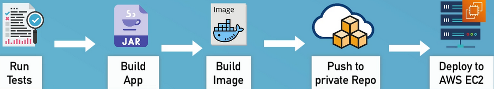
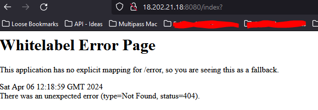

## Demo Project: 
### Deploy Web Application on EC2 Instance (manually)

#### Technologies used:
- AWS, Docker, Linux

#### Project Description:
1. Create and configure an EC2 Instance on AWS
2. Install Docker on remote EC2 Instance
3. Deploy Docker image from private Docker
repository on EC2 Instance

[nana git repo](https://github.com/techworld-with-nana/react-nodejs-example)

- Type EC2 into the search bar > click "Launch Instance"
  - name:
    - my-instance
      - you add tags - meta tags, this is mostly seen from a billing point of view, and I think Cloud watch uses it too
  - Application & OS images
    - Amazon linux
      - Others available:
        - mac, Red Hat, Suse, windows
  - Instance type:
    - How much CPU & ram, storage & storage type, this case leave it as Free tier
  - Key pair
    - you need a key pair to SSH into (creating a new one, ones there are used elsewhere)
      - "Create new key pair"
        - name it, chose the type (RSA), format (pem - linux / mac, .ppk (if your on putty)) > create key pair
      - Store pem key somewhere safe
  - Network settings
    - VPC created by default by AWS
    - Subnet, you would change this, if you have setup diff rules in them
    - Auto-assign Public IP
      - Leave as default, need it for ssh and docker
    - Security group
      - Name it: security-group-docker
      - we'll setup FW rules here
        - can create or choose existing
          - create one, comes with default rules (SSH & HTTP)
            - change source IP to your own ip (ssh rule only)
    - Storage
      - Free tier can get up to 30gb Gen purpose (not encrypted)
        - leave as default (8GB)
  - Press Launch Instance


## Connect to EC2 Instance

**Good practice is to change the permissions on the .pem file so only the owner can use it**

- chmod 400 .ssh/pem/MorningCoffee.pem

- in .mder, run:
  - ssh -i MorningCoffee.pem ec2-user@ec2-18-202-21-18.eu-west-1.compute.amazonaws.com


- Install docker on ec2
  - run the usual update ```bash sudo yum update ```


- run the following: ```bash sudo yum install docker -y```
- Next we need to start the Docker Daemon
  - ```bash  sudo service docker start```


  - in order not to have to run sudo for every command, we need to add the user (ec2-user) to the docker group
    - ```bash sudo usermod -aG docker $USER``` (adds user (env var) to docker group) (dont forget to login & out for effect change)


## Run Web app on EC2

- 1st off we need to clone this [repo](https://github.com/techworld-with-nana/react-nodejs-example.git)
- build the image and push to our private dockerhub


**NOTE: Don't forget to login to docker from the EC2**





- bind the port 3000:3080!

run the following: ```bash docker run -d -p 3000:3080 jadedjelly/reactnodejsapp:1.0 ```



## Make app accessible from browser

- back on the AWs console (for the instance), we need to open port 3000
- Either click the security group from the menu (left side) or from teh security tab
  - click "Edit inbound rules"
    - create custom rule for port 3000 (I gave it a tag)


- save rules
- get the public IP of the ec2, open a browser [publicIP]:3000 (you can also use the DNS name: 3000)


