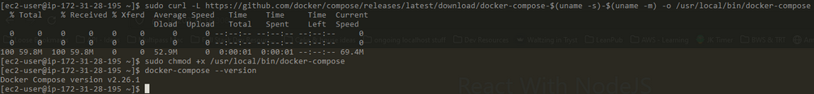
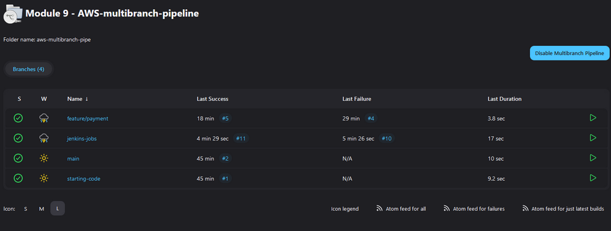
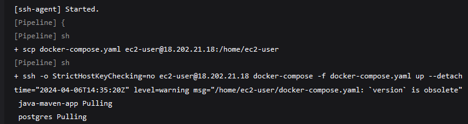
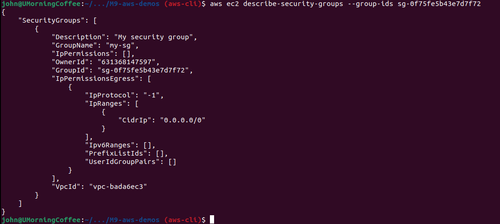
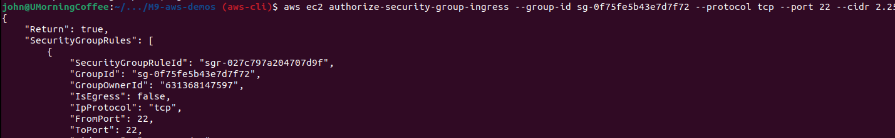
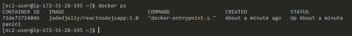
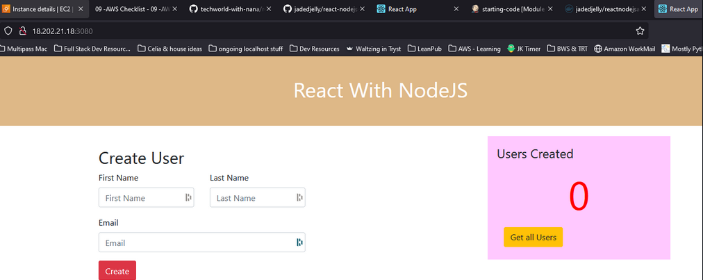

## Demo Project: 
### Interacting with AWS CLI

#### Technologies used:
- AWS, Linux

#### Project Description:
1. Install and configure AWS CLI tool to connect to our AWS account
2. Create EC2 Instance using the AWS CLI with all necessary configurations like Security Group
3. Create SSH key pair
4. Create IAM resources like User, Group, Policy using the AWS CLI
5. List and browse AWS resources using the AWS CLI

#### Demo for Intro to AWS - CLI Part 1

- Install AWS cli (I already have it installed)



- Configure AWS cli to connect to aws account
  - (when I created the admin account, it was given permission to use the CLI / console)
    - We will need the Access ID & secret pass

- run aws configure & press enter, you'll be prompted for ID and password
```bash
aws configure
```

- can find the config files > ~/.aws
  - config (region & output)
  - credentials (access id & key [both in clear text])

### Create a security group (cli)

- we can list current security groups, running ```bash aws ec2 describe-security-groups```

- to create a new one, we need to give it a VPC id, because security groups need to be created in one
  - run ``` aws ec2 describe-security-groups | grep VpcId``` to get the Vpc ID
  - or ``` aws ec2 describe -vpcs```

To create a new security group, we run the below:

```bash
aws ec2 create-security-group --group-name my-sg --description "My security group" --vpc-id vpc-bada6ec3
```



- running we get more information on the group

```bash
aws ec2 describe-security-groups --group-ids sg-0964c17422327575c
```



- We need to add the inbound rule to allow 22 on the new group, we'll do this with

```bash
aws ec2 authorize-security-group-ingress --group-ids sg-0964c17422327575c --protocol tcp --port 22 --cidr 2.25.9.9/32
```

- on successful execution we get the below



### Create a key pair (cli)

*NOTE: keep --key-name & output name the same!!!!! - Otherwise it causes problems when using for ssh*

- "--query xxxx" = download & keep key attributes locally
  - KeyMaterial = unencrypted private key
  - output text = get an unencrypted keypair, so we store locally (piping it to a file)

- We run

```bash
aws ec2 create-key-pair --key-name mykeypairCLI --query 'KeyMaterial' --output text > mykeypairCLI.pem
```

- the pem file is now located in your ~ (moved to .ssh pem folder)

*NOTE:* this did not work for me, 



```bash aws ec2 create-key-pair --key-name my-key --query "KeyMaterial" --output text > my-key.pem```


**Note: double quotes for query fixed it**


### Create an ec2 from the cli

- still need some info, like:
  - image-id
  - subnet-id

We'll get both of these by running the "describe" cmd on the currently running ec2 (assumed)

- running ```bash aws ec2 describe-subnets``` and the output shows us the 3 AZ subnets (as below)



- for the demo it doesn't matter what subnet we use, so we'll grab the 1st one
- the last  part we need is the image id / ami
  - we could use the UI to get all the info instead of going through the cli, but it's a good example of the info you can grab from it


```bash
aws ec2 run-instances 
    --image-id ami-0f007bf1d5c770c6e 
    --count 1 
    --instance-type t2.micro 
    --key-name mykey
    --security-group-ids sg-0964c17422327575c 
    --subnet-id subnet-d5de2f9e
```

- After execution, we get an output in json format, this includes:
  - Private DNS & IP (IPv4 & IPv6)
  - storage
  - etc (all the info you would expect)

- after a few mins the instance is up and running, and we can get the Public IPv4 addr (176.34.195.157)
- *NOTE: change the permissions of the pem file!*
- now we run the 

```bash
ssh -i ~/pem/mykeypairCLI.pem ec2-user@176.34.195.157
```

Stop instances:
```bash aws ec2 stop-instances --instance-id i-0b59dbba573ddc112```

terminate instance
```bash aws ec2 terminate-instances --instance-id i-0b59dbba573ddc112```

```bash
aws ec2 run-instances --image-id ami-0f007bf1d5c770c6e --count 1 --instance-type t2.micro --key-name my-key --security-group-ids sg-0964c17422327575c --subnet-id subnet-d5de2f9e
```
```bash ssh -i my-key ec2-user@54.220.248.62 ```


