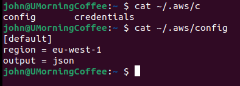
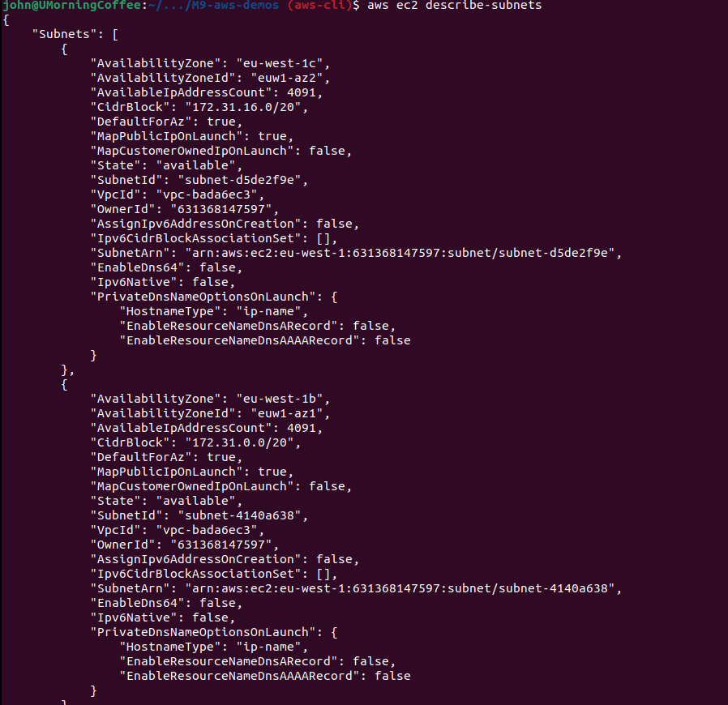
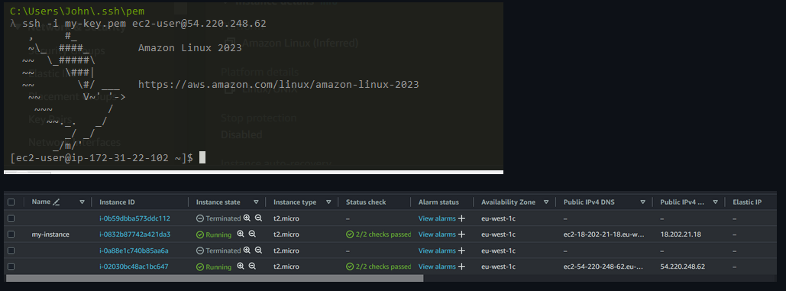

## Demo Project: 
### CD - Deploy Application from Jenkins Pipeline on EC2 Instance (automatically with docker-compose)

#### Technologies used:
- AWS, Jenkins, Docker, Linux, Git, Java, Maven, Docker Hub

#### Project Description:
1. Install Docker Compose on AWS EC2 Instance
2. Create docker-compose.yml file that deploys our web application image
3. Configure Jenkins pipeline to deploy newly built image using Docker Compose on EC2 server
4. Improvement: Extract multiple Linux commands that are executed on remote server into a separate shell script and execute the script from Jenkinsfile

**Note: Install Docker-compose on AWS linux documentation > [here](https://gist.github.com/npearce/6f3c7826c7499587f00957fee62f8ee9)**

- SSH to EC2
- Docker-compose isn't installed via yum, so we run the below:

```bash
sudo curl -L https://github.com/docker/compose/releases/latest/download/docker-compose-$(uname -s)-$(uname -m) -o /usr/local/bin/docker-compose
```

- then we run the chmod .md to make it executable ```sudo chmod +x /usr/local/bin/docker-compose```
- along with --version to verify


- Cleaning up docker (images / containers etc)



## creating Docker-compose file

- From the java-maven-app/jenkins-jobs branch
  - create a new file called
    - docker-compose.yaml
  - We want to start a java-maven docker image & an additional postgres image
  - Below is our docker-compose.yaml file:

```yaml
version: '3.8'
services:
    java-maven-app:
      image: jadedjelly/mod9demo-app:java-maven-1.0
      ports:
        - 8080:8080
    postgres:
      image: postgres:15
      ports:
        - 5432:5432
      environment:
        - POSTGRES_PASSWORD=my-pwd
```

- with the docker-compose file created, we need to adjust the Jenkinsfile to use it instead of the deploy block we have currently:

```groovy
stage("deploy") {
            steps {
                script {
                    echo 'deploying docker image to EC2...'
                    def docker.md = "docker run -p 8080:8080 -d ${IMAGE_NAME}"
                    sshagent(['ec2-server-key']) {
                        sh "ssh -o StrictHostKeyChecking=no ec2-user@18.202.21.18 ${docker.md}"
                    }
                }
            }
        }
```

- We need to have the docker-compose file on the server, we will write this inside the Jenkinsfile
- Open the Jenkinsfile, and amend the following:

**Note2: when using the scp command, if the yaml file is located in another folder (within the structure, we would just as it as src/ etc),**
**Jenkins would have checked out the commit by the time it gets to the deploy stage so will have access to said yaml**
**```bash scp <file> remotetarget:remotedir``**

```groovy
stage("deploy") {
            steps {
                script {
                    echo 'deploying docker image to EC2...'
                    def dockerCompose = "docker-compose -f docker-compose.yaml up --detach"
                    sshagent(['ec2-server-key']) {
                        sh "scp docker-compose.yaml ec2-user@18.202.21.18:/home/ec2-user"
                        sh "ssh -o StrictHostKeyChecking=no ec2-user@18.202.21.18 ${dockerCompose}"
                    }
                }
            }
        }
```

- we can commit now
- Build job ran successfully, output console below:


output from EC2


## Improvements: extract to sh scripts

- Create a shell script, name it "server-.mds.sh"
  - copy the docker-compose .md to the sh script & along with the shebang
  - def a variable & command to execute the server-.mds.sh
  - we need the shell script on ec2, so we run another scp .md

server-.mds.sh
```bash
#!/usr/bin/env bash


docker-compose -f docker-compose.yaml up --detach
echo "success"
```

Jenkinsfile
```groovy
stage("deploy") {
            steps {
                script {
                    echo 'deploying docker image to EC2...'
                    def shell.mds = "bash ./server-.mds.sh"
                    sshagent(['ec2-server-key']) {
                        sh "scp server-.mds.sh ec2-user@18.202.21.18:/home/ec2-user"
                        sh "scp docker-compose.yaml ec2-user@18.202.21.18:/home/ec2-user"
                        sh "ssh -o StrictHostKeyChecking=no ec2-user@18.202.21.18 ${shell.mds}"
                    }
                }
            }
        }
```

- commit changes & stop currently running containers & delete them
- run Jenkins job


Jenkins-jobs output console: (scp copy to ec2)


EC2 Docker ps



## Improvements: Replace Docker Image with newly built version

- in the docker-compose file, the image is hardcoded
- However, in the real world, this version will be ever changing (major.minor.patch)
  - we need to create an image variable, 
 
From Jenkinsfile > shell Script via Parameter access via the $1 & the ```bash export $IMAGE=$1``` <- this envVar will be set on ec2
the script (sh) gets executed on the ec2

Jenkinsfile
```groovy
stage("deploy") {
            steps {
                script {
                    echo 'deploying docker image to EC2...'

                    def shell.mds = "bash ./server-.mds.sh ${IMAGE_NAME}"

                    sshagent(['ec2-server-key']) {
                        sh "scp server-.mds.sh ec2-user@18.202.21.18:/home/ec2-user"
                        sh "scp docker-compose.yaml ec2-user@18.202.21.18:/home/ec2-user"
                        sh "ssh -o StrictHostKeyChecking=no ec2-user@18.202.21.18 ${shell.mds}"
                    }
                }
            }
        }
```

docker-compose.yaml
```yaml
version: '3.8'
services:
    java-maven-app:
      image: ${IMAGE}
      ports:
        - 8080:8080
    postgres:
      image: postgres:15
      ports:
        - 5432:5432
      environment:
        - POSTGRES_PASSWORD=my-pwd
```

server-.mds.sh
```bash
#!/usr/bin/env bash

export IMAGE=$1
docker-compose -f docker-compose.yaml up --detach
echo "success"
```

- commit changes & run the jenkins-jobs again
- Successfully run, docker ps command below showing apps running:



## More minor optimizations

- In the Jenkinsfile, we use the ec2-user 3x times so we could change it into a variable 

```groovy
stage("deploy") {
            steps {
                script {
                    echo 'deploying docker image to EC2...'

                    def shell.mds = "bash ./server-.mds.sh ${IMAGE_NAME}"
                    def ec2Server = "ec2-user@18.202.21.18"
                    sshagent(['ec2-server-key']) {
                        sh "scp server-.mds.sh ${ec2Server}:/home/ec2-user"
                        sh "scp docker-compose.yaml ${ec2Server}:/home/ec2-user"
                        sh "ssh -o StrictHostKeyChecking=no ${ec2Server} ${shell.mds}"
                    }
                }
            }
        }
```

- you can also (within the docker-compose file) set the image to use a variable ${TAG} and add it to the incrementing block we created in an earlier module
- We should also extract all the logic from the deploy stage and add it to the shared-library repo
